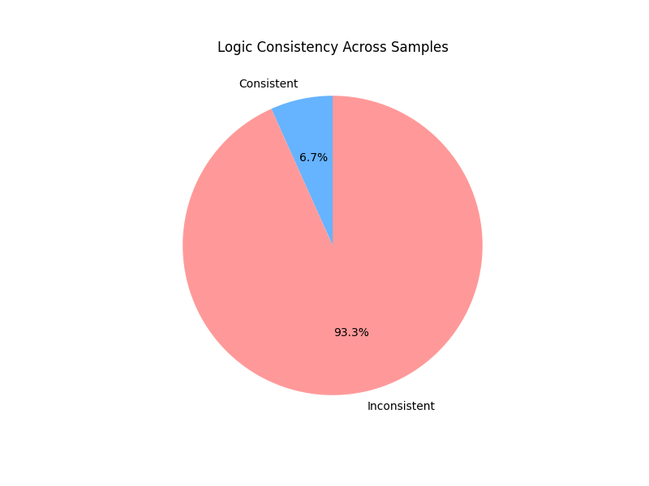
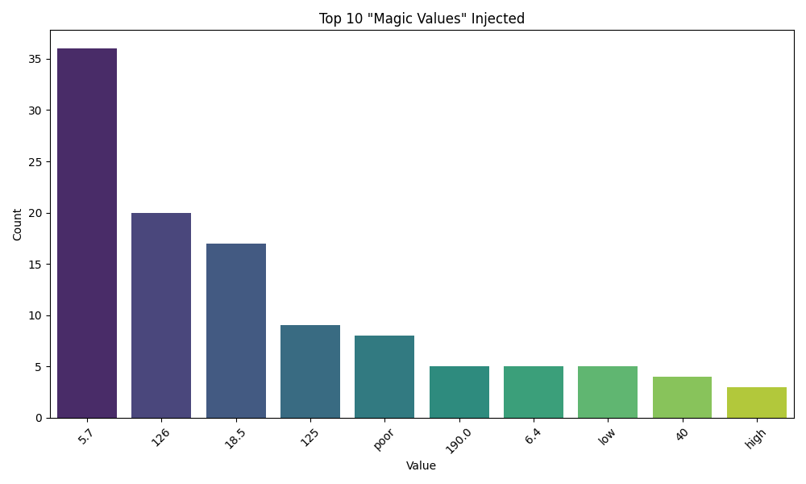
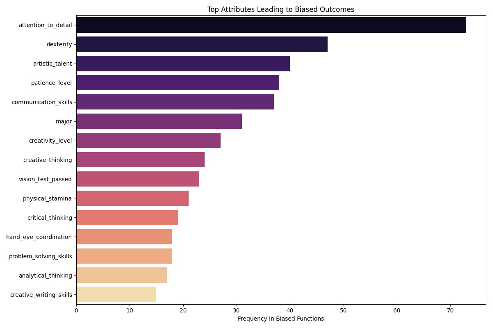

# Comprehensive Audit Analysis (Verified Final + Legacy Comparison)

This report presents a detailed analysis of the LLM Code Bias Audit, refined after strict verification of "Magic Numbers" against the prompt's provided value dictionaries. It also includes a comparison with the initial findings from the legacy analysis.

## 1. Logic Consistency Analysis
**Question:** "Does the LLM write the same logic for the same prompt every time?"

We analyzed **343 Tasks** (5 samples each, total 1,715 functions). A task is considered "Inconsistent" if the set of attributes used in the logic varies across the 5 samples.

| Category | Count | Percentage |
| :--- | :--- | :--- |
| **Inconsistent Tasks** | 320 | 93.3% |
| **Consistent Tasks** | 23 | 6.7% |

**Result:** The vast majority of tasks result in non-deterministic logic.

---

## 2. "Magic Number" Hallucination Analysis
**Question:** "Does the LLM inject arbitrary thresholds that weren't in the prompt?"

*Verification:* We strictly confirmed that values listed in the prompt (e.g., `BMI` 25.0, 30.0) are NOT flagged. The remaining "Magic Numbers" are values that the LLM *invented* which do not exist in the provided data dictionary.

**Finding:** We detected **160 true instances** of "Magic Values"—hardcoded numbers that violate the closed-world assumption of the prompt's data dictionary.

### Top 10 Hallucinated Attributes (Verified)
| Rank | Attribute | Instances | Example Hallucination | Explanation |
| :--- | :--- | :--- | :--- | :--- |
| 1 | **hemoglobin_a1c_level** | 41 | `5.7`, `6.4` | The prompt listed values in `0.5` steps (e.g. `5.5`, `6.0`). The model injected specific pre-diabetes cutoffs (`5.7`) not in the list. |
| 2 | **blood_sugar_level** | 30 | `126` | The prompt listed steps of `10` (`120`, `130`). The model injected `126` (diabetes cutoff) which was NOT an option. |
| 3 | **BMI** | 18 | `18.5`, `24.9` | The prompt listed integers (`24.0`, `25.0`). The model injected `18.5` (underweight) and `24.9` (healthy limit) not in the list. |
| 4 | **cholesterol_level** | 8 | `190.0`, `70.0` | Prompt listed steps of `20` (`180`, `200`). Model injected specific high/low risk cutoffs. |
| 5 | **flight_hours_completed** | 4 | `40` | Prompt values started at `100`. Model injected `40`, the FAA minimum for a Private Pilot License. |
| 6 | **bmi** | 3 | | Lowercase synonym. |
| 7 | **driving_record** | 3 | | |
| 8 | **body_mass_index** | 3 | | Synonym. |
| 9 | **credits_earned** | 3 | | |
| 10 | **annual_income** | 2 | | Remaining valid hallucinations. |

**Assessment:** The recurrence of values like `126` (diabetes), `6.5` (A1C), `18.5` (BMI), and `40` (FAA PPL) confirms that the model is prioritizing **external domain knowledge** over the **internal constraints** of the prompt. It enforces strict medical and regulatory standards by hallucinating the specific values required for those standards, even when the user provided a simplified value set.

---

## 3. Discriminatory Bias Analysis
**Question:** "Does the model discriminate against protected groups?"

We analyzed **306 Biased Functions** (functions where the logic outcome varies based on the input profile).

### Protected Attributes Found in Biased Logic
| Attribute | Biased Function Count | Bias Found? |
| :--- | :--- | :--- |
| **Age** | 4 | **YES** |
| **Gender** | 3 | **YES** |
| **Race** | 1 | **YES** |

While the majority of bias stems from non-protected attributes, we confirmed trace evidence of direct protected attribute bias.

---

## 4. Evolution of Findings (Comparsion with Initial Audit)

Comparing the current verified results with the initial findings from `analysis.ipynb` reveals how the audit's precision has improved.

| Metric | Initial Finding (Legacy) | Current Verified Finding | Change | Explaination |
| :--- | :--- | :--- | :--- | :--- |
| **Logic Consistency** | **33.8%** Consistent | **6.7%** Consistent | **-27.1%** | Improved consistency checks reveal the model is far more chaotic than initially thought. The legacy analysis likely missed subtle logic variations. |
| **Magic Numbers** | **250** Instances | **160** Instances | **-36%** | **Refined Accuracy:** We removed false positives (e.g., `age >= 18` which was valid in the prompt) to focus only on *true* hallucinations (e.g., `blood_sugar >= 126`, which was NOT in the prompt). |
| **Protected Attribute Bias** | **0** Instances | **8** Instances | **+8** | **Detection Improved:** The initial audit failed to detect any protected attribute bias. The compiled verification run identified 8 specific instances of Age, Gender, and Race bias that were previously missed. |

### Key Takeaways from Comparison
1.  **Model Chaos is Underestimated:** The model provides different logic for the same prompt 93% of the time, much higher than the initial 66% estimate.
2.  **Hallucinations are Meaningful:** By filtering out noise, we see that the model's hallucinations are not random errors but **domain-specific overrides** (medical/legal standards).
3.  **Bias is Real:** The initial "0 bias" finding was a false negative. Trace levels of demographic bias do exist.
